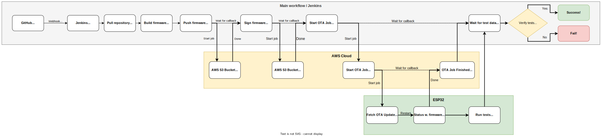

# Automated remote OTA deployment and testing on ESP32 with Jenkins and AWS

_This repo holds the project files that were used for a demonstration in the course DD2482 "Automated Software Testing and DevOps"._

## Pipeline overview
The following [flowchart](https://raw.githubusercontent.com/EdmanJohan/DD2482-ESP-CICD/main/DemoWorkFlow.svg) gives an overview of the pipeline
that made up the demonstration.



## How to setup

1. Setup Jenkins server (with the [Jenkins pipline script](./jenkinsfile)) _Note: that some names must be changed to match your AWS setup_
2. Install dependencies (Git, Python) on server.
3. Clone Amazon [FreeRTOS repository](https://github.com/aws/amazon-freertos).
4. Follow ["Getting started tutorial with ESP32 and AWS"](https://docs.aws.amazon.com/freertos/latest/userguide/getting_started_espressif.html).
5. Follow ["Tutorial to install initial firmware on ESP32 for OTA"](https://docs.aws.amazon.com/freertos/latest/userguide/burn-initial-firmware-esp.html).
6. Push your initial firmware source code to new repo on Github.
7. Setup webhook from Github to Jenkins (Github repo settings) which triggers the Jenkins pipline whenever something is pushed to the repo.
8. Add a new thread for your own code to run aside the OTA process like here [File](/demos/demo_runner/iot_demo_runner.c).
```
Iot_CreateDetachedThread( runTestDemo,
                          NULL,
                          (democonfigDEMO_PRIORITY - 1),
                          democonfigDEMO_STACKSIZE );
```
9a. Our test demo was basically just doing an https post to the server that runs jenkins (See [Code](demos/demo_runner/dd2482.c) ).
```
void runTestDemo( void * pArgument )
{
    vTaskDelay( pdMS_TO_TICKS( 5000 ) );
    IotLogInfo( "Hello from runTestDemo!" );
    testSetup();
    sendHttpRequest( &transportInterface,
                     HTTP_METHOD_POST,
                     POST_PATH );
}
```
9b. A webhook in Jenkins catches the HTTPS post and compares the sent data with the expected data.
